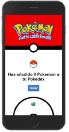
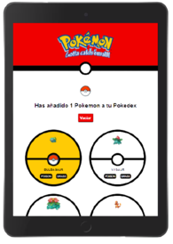
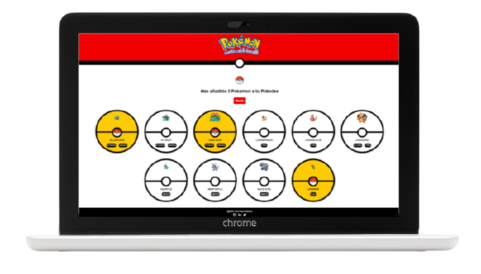

  

# **Pokemon**

Half module 3 project of the Adalab Digital Frontend Development Bootcamp.

This is a responsive save Pokemon on your Pokedex app developed with [](https://html.spec.whatwg.org/) [](https://sass-lang.com/)
[](https://www.w3.org/Style/CSS/) [](https://www.ecma-international.org/ecma-262/) and [](https://es.reactjs.org/)

## **Quick start guide**

Instructions to start this project:

## Installation

- Clone repository:

```
git clone [repository]
```

- Install NPM packages and dependencies:

```
npm install
```

- Run project on local server:

```
npm start
```

- **[Project URL](https://anaguerraabaroa.github.io/pokemon/)** is also available on GitHub Pages.

## **Features**

- React app
- Components structure
- Render a Pokemon list with information from pokemons.json file
- Render a Pokemon card using props information
- Save favourites Pokemon on Pokedex and change favourites Pokemon background colour
- Reset Pokedex

## **Usage**

### **1. App component**

- Handle app, favourites Pokemon list and reset

```javascript
function App() {
  const [pokedex] = useState(pokemons);
  const [favourites, setFavourites] = useState([]);

  const handleFavourites = (clickedPokemon) => {
    if (!favourites.includes(clickedPokemon)) {
      const newFavourites = [...favourites, clickedPokemon];
      setFavourites(newFavourites);
    } else {
      const newFavourites = favourites.filter((favourite) => {
        return favourite !== clickedPokemon;
      });
      setFavourites(newFavourites);
    }
  };

  const handleClick = () => {
    setFavourites([]);
  };

  return (
    <div className="page">
      <Header />
      <main className="main" role="main">
        <PokeFavourites favourites={favourites} handleClick={handleClick} />
        <PokeList
          list={pokedex}
          handleFavourites={handleFavourites}
          favourites={favourites}
        />
      </main>
      <Footer />
    </div>
  );
}
```

### **2. PokeList component**

- Render Pokemon list and create Pokemon individual card component

```javascript
const PokeList = (props) => {
  const pokemonItems = props.list.map((pokemonItem) => {
    return (
      <li key={pokemonItem.id}>
        <Pokemon
          pokemonItem={pokemonItem}
          handleFavourites={props.handleFavourites}
          favourites={props.favourites}
        />
      </li>
    );
  });
  return (
    <>
      <ul className="pokemon__list">{pokemonItems}</ul>
    </>
  );
};
```

### **3. Pokemon component**

- Render Pokemon individual card and handle favourite Pokemon class and Pokemon types

```javascript
const Pokemon = (props) => {
  const handleFavourites = (ev) => {
    const clickedPokemon = parseInt(ev.currentTarget.id);
    props.handleFavourites(clickedPokemon);
  };

  const pokemon = props.pokemonItem.types.map((type, index) => {
    return (
      <li key={index} className="type">
        {type}
      </li>
    );
  });

  return (
    <div
      id={props.pokemonItem.id}
      className={`${"pokemon__card"} || ${
        props.favourites.includes(parseInt(props.pokemonItem.id))
          ? "pokemon__card--favourite"
          : "pokemon__card"
      }`}
      onClick={handleFavourites}
    >
      
      <div className="pokemon__stripe"></div>
      <div className="pokemon__button">
        
      </div>
      <h2 className="pokemon__name">{props.pokemonItem.name}</h2>
      <ul className="pokemon__types">{pokemon}</ul>
    </div>
  );
};
```

### **4. PokeFavourites component**

- Handle number of favourite Pokemons in the Pokedex

```javascript
const PokeFavourites = (props) => {
  return (
    <div className="favourites">
      
      <h2 className="favourites__title">
        Has añadido {props.favourites.length} Pokemon a tu Pokedex
      </h2>
      <button className="favourites__reset" onClick={props.handleClick}>
        Vaciar
      </button>
    </div>
  );
};
```

## **Folder Structure**

```
Pokemon
├── docs
├── node_modules
├── public
├── src
│   ├── components
│   │   ├── App.js
│   │   ├── Footer.js
│   │   ├── Header.js
│   │   ├── PokeFavourites.js
│   │   ├── PokeList.js
│   │   └── Pokemon.js
│   ├── data
│   │    └── pokemons.json
│   ├── images
│   │    ├── logo.png
│   │    ├── pokeball.png
│   │    ├── pokemon_desktop.png
│   │    ├── pokemon_mobile.png
│   │    └── pokemon_tablet.png
│   ├── stylesheets
│   │   ├── core
│   │   │   ├── _reset.scss
│   │   │   └── _variables.scss
│   │   ├── layout
│   │   │   ├── _footer.scss
│   │   │   ├── _header.scss
│   │   │   ├── _pokeFavourites.scss
│   │   │   ├── _pokeList.scss
│   │   │   └── _pokemon.scss
│   │   ├── pages
│   │   │   └── index.scss
│   │   └── App.scss
│   └── index.js
├── .gitignore
├── debug.log
├── LICENSE
├── package-lock.json
├── package.json
└── README.md
```

## **License**

This project is licensed under 
