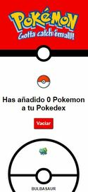
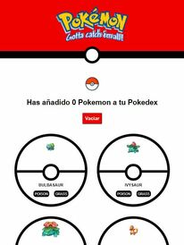
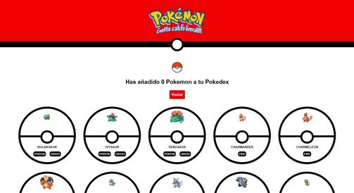

# **Pokemon**

Half module 3 project of the Adalab Digital Frontend Development Bootcamp.

This is a responsive save Pokemon on your Pokedex app developed with [](https://html.spec.whatwg.org/) [](https://www.w3.org/Style/CSS/) [](https://sass-lang.com/) [](https://www.ecma-international.org/ecma-262/) and [](https://es.reactjs.org/).

## **Quick start guide**

Instructions to start this project:

### **Pre-requirements**

This project runs with [](https://es.reactjs.org/). Start guide [**here**](https://github.com/facebook/create-react-app).

### **Installation**

Once React has been installed:

1. Clone repository
2. Open a terminal
3. Run `npm install` on the terminal to install local dependencies

### **Run project**

Run `npm start` on the terminal:

1. Open the project on the browser using a local server.
2. Refresh browser everytime files contained in `/src` folder are updated.
3. Compiled files contained in `/src` folder and copy them in `/public` folder in order to be prepared for production environment.

### **Updating**

1. Run these commands to update changes on the project:

```
git add -A
git commit -m "Message commit"
git push
```

2. Run `npm run build` to create `/docs` folder and the production environment version.

3. Run again commands on step 1 to update changes on the project.

4. Project **[URL](https://anaguerraabaroa.github.io/pokemon/)** is also available on GitHub Pages.

## **Project features**

- React app
- Components structure
- Render a Pokemon list with information from pokemons.json file
- Render a Pokemon card using props information
- Save favourites Pokemon on Pokedex and change favourites Pokemon background colour
- Reset Pokedex

## **Folder Structure**

```
Pokemon
├── docs
├── node_modules
├── public
├── src
│   ├── components
│   │   ├── App.js
│   │   ├── Footer.js
│   │   ├── Header.js
│   │   ├── PokeFavourites.js
│   │   ├── PokeList.js
│   │   └── Pokemon.js
│   ├── data
│   │    └── pokemons.json
│   ├── images
│   │    ├── logo.png
│   │    ├── pokeball.png
│   │    ├── pokemon_desktop.jpg
│   │    ├── pokemon_mobile.jpg
│   │    └── pokemon_tablet.jpg
│   ├── stylesheets
│   │   ├── core
│   │   │   ├── _reset.scss
│   │   │   └── _variables.scss
│   │   ├── layout
│   │   │   ├── _footer.scss
│   │   │   ├── _header.scss
│   │   │   ├── _pokeFavourites.scss
│   │   │   ├── _pokeList.scss
│   │   │   └── _pokemon.scss
│   │   ├── pages
│   │   │   └── index.scss
│   │   └── App.scss
│   └── index.js
├── .gitignore
├── debug.log
├── LICENSE
├── package-lock.json
├── package.json
└── README.md
```

## **Components and functions**

### **App component**

- **Handle app:** function App()
- **Handle favourites:** const handleFavourites
- **Handle reset:** const handleClick

### **Header component**

- **Render header:** const Header

### **PokeList component**

- **Render individual Pokemon card component:** const pokemonItems
- **Render Pokemon list:** const PokeList

### **Pokemon component**

- **Event listener favourites Pokemon:** const handleFavourites
- **Render data Pokemon card and add favourites Pokemon class**: const Pokemon
- **Render Pokemon types data**: const pokemon

### **PokemonFavourites component**

- **Event listener reset button:** const handleClick
- **Render number of favourites Pokemon on the Pokedex**: const PokeFavourites

### **Footer component**

- **Render footer:** const Footer

## **Screenshots**

  

## **License**

This project is licensed under [**MIT License**](https://spdx.org/licenses/MIT.html).
